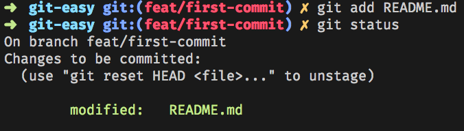

author: Gabin Darras
summary: Git Easy
id: codelabs-gitEasy
categories: git
environments: javascript
status: draft
feedback link: github.com/gabindarras
analytics account: 0

# Git - Débutant

## Présentation

Une question ? Une difficulté ? : **gabin.darras@ineat-conseil.fr**

Pré-requis:

- Avoir **git** installé sur votre machine.
- Avoir un compte Github/Gitlab pour pouvoir forker le projet

## Récupération du projet

Ouvrez un terminal à l'endroit où vous souhaitez dérouler ce CodeLabs

```
git clone le-nom-de-votre-projet-après-le-fork
```

Cette commande vous permettra de récupérer le projet 'git', pour pouvoir manipuler les différentes commandes il faut se mettre à la racine de ce dernier, pour cela :

```
cd git
```

## Branches

### Liste des branches disponibles

Pour récupérer la liste des branches, entrez la commande ci-dessous :

```
git branch
```

À ce stade nous n'avons qu'une seule et unique branche **master**, comme cette branche n'est destinée qu'à la production nous allons devoir en créer une autre pour le développement.

### Création d'une branche

Pour créer une nouvelle branche, entrez la commande suivante :

```
git branch develop
```

La branche **develop** vient d'être créée, pourtant nous sommes toujours sur la branche **master**, pour s'en rendre compte faîtes la commande git branch que vous maitrisez maintenant parfaitement bien :)

### Changement de branche

Nous devons maintenant nous placer sur la **develop** pour pouvoir commencer à travailler :

```
git checkout develop
```

Nous sommes maintenant prêt à travailler !

## 1e commit

**Hé la hé la pas si vite voyons, la branche develop est elle aussi protégée ! Encore ? Et oui vous imaginez si tous les développeurs travaillaient sur la même branche de travail, ça serait l'anarchie ! À chaque nouveau dev on tire une branche à partir de develop**

### Astuce pour chaque nouvelle branche

On a vu précédemment comment créer une nouvelle branche et comment se placer dessus. Mais tout dev qui se respecte est fénéant et faire 2 commandes pour une simple action ne me plaît pas ! Heureusement git nous permet de faire ces 2 opérations en une, pour cela entrez la commande suivante :

```
git checkout -b le-nom-de-ma-nouvelle-branche
```

le -b signifie ici nouvelle branche

### La branche feat/first-commit

#### Création

Maintenant que vous connaissez la commande pour créer et switcher sur une nouvelle branche vous pouvez créer la branche **first-commit** :

```
git checkout -b first-commit
```

#### Modification

Comme vous l'avez très justement remarqué le nom de la branche est incorrect car il n'indique pas le type de branche qu'on souhaite créer. Mais pas de panique c'est très facile de renommer notre branche grâce à la commande

```
git branch -m le-nom-de-ma-branche-actuelle le-nouveau-nom
```

Ce qui donnera dans notre cas :

```
git checkout -m first-commit feat/first-commit
```

Un petit coup de 'git branch' pour s'assurer que la branche a bien été modifée.

### Modification du fichier README.md

Ouvrez le fichier README.md et recopier le texte suivant

```
Ce projet a pour but de vous enseigner les bases de git !
Pour cela, déroulez le CodeLabs : https://github.com/gabindarras/git-CodeLabs-easy
```

Vous pouvez à tout moment consulter l'état de modification avec la commande

```
git status
```

Voici ce qu'on obtient


Le fichier est en rouge donc ça veut dire que les modifications n'ont pas encore été indexées donc nous ne sommes pas encore prêt à commit.

### Introduction au fichier de config

Le fichier de config est un fichier global à git partagé entre tous vos projets. Il permet de simplifier certaines commandes ou d'ajouter des informations par exemple.
Dans notre cas, nous allons indiquer à git qui nous sommes.
Voici les 2 commandes à taper :

```
git config --global user.email [votre email]
git config --global user.name [prenom nom]
```

Vous pouvez également à tout moment avoir accès à la configuration complète :

```
git config --global -l
```

### Indexation, commit & push

#### Indexation

Après avoir modifié un ou plus fichiers, il faut les indexer, c'est à dire indiquer à git que ces derniers sont prêts à être commit.

Pour cela exécutez la commande suivante :

```
git add README.md
```

puis un 'git status', vous obtenez ceci


#### Commit

Le fichier est maintenant prêt à être commit sur la remote, voici la commande :

```
git commit -m "feat(readme): add CodeLabs infos"
```

En faisant un 'git status' on s'aperçoit que les modifications ont bien été prises en compte, il ne nous reste qu'à push !

#### Push

En l'état actuel des choses les modifications sont sur la remote mais pas encore sur le repo distant, pour cela exécutez la commande suivante :

```
git push origin feat/first-commit
```
Pour déduire la partie origine my_branch vous pouvez ajouter cette configuration
```
git config --global push.default current
```
Maintenant vous pouvez faire:
```
git push
```
### Historique

Pour consulter l'historique des commits effectués vous avez la commande suivante :

```
git log
```

Le git log étant assez moche, nous allons créer un alias dans le fichier de configuration. Un alias est un mot clé qu'on pourra par la suite utiliser pour une action spécifique, voici un exemple :

```
git config --global alias.lg "log --color --graph --pretty=format:'%Cred%h%Creset -%C(yellow)%d%Creset %s %Cgreen(%cr) %C(bold blue)<%an>%Creset' --abbrev-commit"
```

Ici on crée un alias qu'on appelle lg qui est en fait un log customisé et simplifié avec des couleurs.

Vous pouvez maintenant lancer la commande :

```
git lg
```

C'est quand même beaucoup plus lisible ! :)

### Reset

Git nous offre la possibilité d'annuler une action qu'on vient de faire. Attention toutefois certaines annulations peuvent être dangeureuses ! Voici 2 exemples :

#### Soft

Petit rappel la commande git add permet d'indexer un ou plusieurs fichiers avant le commit. Pour voir que ces fichiers ont bien été indexés vous pouvez exécuter la commande git status qui vous indiquera l'état de chaque fichier. Si un fichier est rouge c'est qu'il n'est pas indexé, c'est à dire qu'il n'est pas prêt à être commit. À l'inverse si il est vert c'est qu'il peut être commit. On a vu précédemment comment faire passer un fichier du rouge au vert (donc prêt à être commit), voyons maintenant comment le faire passer du vert au rouge !
Voici la commande :

```
git reset
```

On appelle ce reset "soft" car il ne fait que modifier l'état d'un fichier mais garde toutes les modifications qui ont pu être effectuées.

#### Hard

Le reset "hard" va un peu plus loin que le reset soft dans le sens où il supprime également toutes les modifications d'un fichier. C'est une commande très puissante mais qui peut s'avérer dangeureuse car vos modifications seront perdues à tout jamais !

```
git reset --hard
```

#### Checkout

On peut se retrouver dans le cas suivant : 2 fichiers ont été modifiés et sont prêts à être commit, mais on s'aperçoit qu'un des 2 fichiers a été modifié à tort donc on aimerait revenir à l'état initial. Le problème du reset --hard est qu'il s'applique à TOUS les fichiers...ce qui est plutôt embêtant dans notre cas. Heureusement il est possible de faire ça fichier par fichier. Pour cela :

```
git checkout le-nom-de-mon-fichier
```

## À vous de jouer

1. Créer une nouvelle branche
2. Créer un fichier (example.txt)
3. Ajouter dans ce fichier l'ensemble des commandes qui vous servira à push sur votre branche
4. Indexer ce fichier (sans le commit !!)
5. Vérifier que ce fichier est bien dans l'index
6. Supprimer le fichier (Avec git bien évidemment :))
7. Modifier le fichier README.md en ajoutant vos impressions sur git !
8. Indexer/commit et push de votre branche
9. Regarder votre historique !

Pour aller plus loin

10. Tirer une nouvelle branche
11. Créer un nouveau fichier
12. Modifier le fichier README.md
13. Indexer les 2 fichiers
14. Supprimer les modifications précédemment ajoutées au fichier README.md (Toujours avec git :))
15. Indexer/commit et push de votre branche
16. Regarder votre historique !
